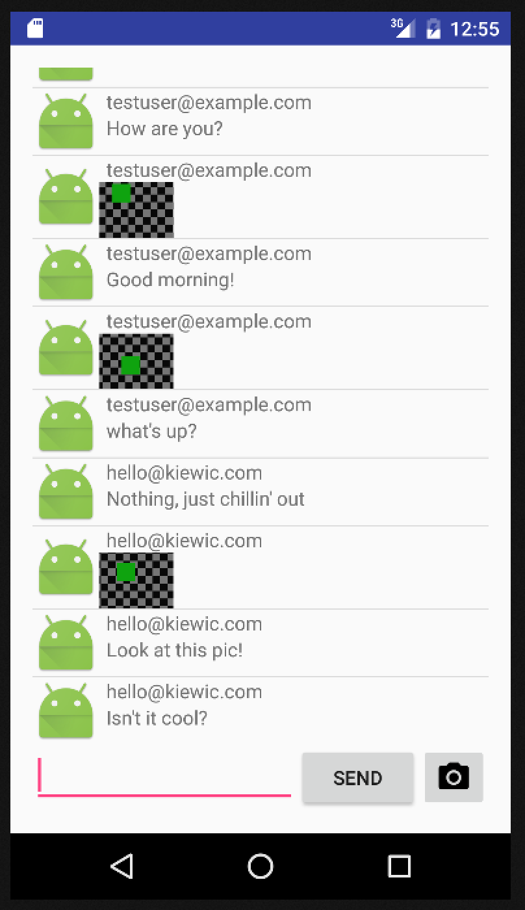

# FirebaseUI-Android-Codelabs-Nanochat

Firebase codelabs [nanochat][codelabs] exercise ... Now with text and **images!**

*How to store images in Firebase?*

[codelabs]: https://github.com/firebase/FirebaseUI-Android/tree/master/codelabs/chat

